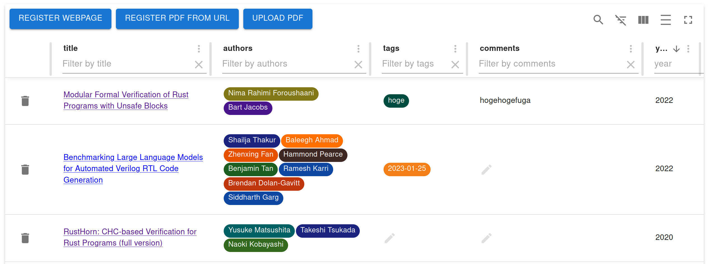

# jendeley <!-- omit in toc -->
`jendeley` is a JSON-based document organizing software.
- `jendeley` is JSON-based. You can see and edit your database easily.
- `jendeley` is working locally. Your important database is owned only by you. No cloud.
- `jendeley` is browser based. You can run it anywhere node.js runs.

## Table of Contents <!-- omit in toc -->
- [Why jendeley?](#why-jendeley)
- [Quickstart](#quickstart)
- [Install](#install)
- [Generate JSON database file](#generate-json-database-file)
  - [Recommended filename style](#recommended-filename-style)
  - [When `jendeley` fails to scan your PDFs](#when-jendeley-fails-to-scan-your-pdfs)
- [Launch `jendeley` UI](#launch-jendeley-ui)
  - [Launch `jendeley` automatically](#launch-jendeley-automatically)
    - [Linux](#linux)
    - [Windows](#windows)
- [Use web interface](#use-web-interface)
  - [Add a webpages](#add-a-webpages)
  - [Add a PDF file on the Web](#add-a-pdf-file-on-the-web)
  - [Upload a PDF file in your computer](#upload-a-pdf-file-in-your-computer)
  - [Use tags and comments](#use-tags-and-comments)
- [Advanced topics](#advanced-topics)
  - [Check and edit your database (advanced)](#check-and-edit-your-database-advanced)
  - [Check source code (advanced)](#check-source-code-advanced)
- [Support us](#support-us)

## Why jendeley?
Programmers need various documents. In addition to it, they are in various formats. For example, they are papers on the newest machine learning, classic compiler books, specification documents of our CPU or accelerators, document of programming languages, or useful blog articles. Programmers must organize these documents classified into categories. Furthermore, we must save them in long term such as 10 years because we cannot know when we need them.

To satisfy such difficult requirements, I developed `jendeley`. You can register PDFs or webpages into the same database. You can easily categorize documents using tags. Furthermore, most importantly, the database is just a plain text JSON file. You can edit it using your favorite editor and develop an alternative application even if I failed to continue `jendeley` development.

## Quickstart
```
npm install @a_kawashiro/jendeley -g
jendeley scan --papers_dir <YOUR PDFs DIR>
jendeley launch --db <YOUR PDFs DIR>/jendeley_db.json
```
Then you can see a screen like this!


## Install
```
npm install @a_kawashiro/jendeley -g
```
You can find the lastest package at [npm page](https://www.npmjs.com/package/@a_kawashiro/jendeley).

## Generate JSON database file
This command outputs the database to `<YOUR PDFs DIR>/jendeley_db.json`. When `jendeley` fails to scan some PDFs, it generates a shellscript named `edit_and_run.sh`. Please read the next subsection and use it to rename files appropriately so that jendeley can recognize them.
```
jendeley scan --papers_dir <YOUR PDFs DIR>
```

### Recommended filename style
`jendeley` uses a filename to find the document ID (e.g. [DOI](https://www.doi.org/) or [ISBN](https://en.wikipedia.org/wiki/ISBN))). `jendeley` recognizes parts of a filename that are not enclosed by `[` and `]` as the title of the file. So I recommend you to name file accordingly, for example,
- `RustHorn CHC-based Verification for Rust Programs.pdf`
  - When the title of document includes spaces, the filename should also includes spaces.
- `RustHorn CHC-based Verification for Rust Programs [matushita].pdf`
  - If you want to write additional information in a filename, please enclose it by `[` and `]`.

### When `jendeley` fails to scan your PDFs
`jendeley` heavily relies on [DOI](https://www.doi.org/) or [ISBN](https://en.wikipedia.org/wiki/ISBN) to find the title, authors and published year of PDFs. So `jendeley` tries to find the DOI of a given PDF in multiple ways. But sometimes it fails to find DOI. In such cases, you can manually specify DOI of the PDF using the filename.

- To specify DOI, change the filename to include `[jendeley doi <DOI with all delimiters replaced with underscore>]`.
  - For example, `cyclone [jendeley doi 10_1145_512529_512563].pdf`.
- To specify ISBN, change the filename to include `[jendeley isbn <ISBN>]`.
  - For example, `Types and Programming Languages [jendeley isbn 0262162091].pdf`.
- When the PDF doesn't have any DOI or ISBN, you can specify it by `[jendeley no id]`.
  - For example `ARM reference manual [jendeley no id].pdf`.

## Launch `jendeley` UI
```
jendeley launch --db <YOUR PDFs DIR>/jendeley_db.json
```
You can use `--port` option to change the default port.

### Launch `jendeley` automatically
#### Linux
When you are using Linux, you can launch `jendeley` automatically using `systemd`. Please make `~/.config/systemd/user/jendeley.service` with the following contents, run `systemctl --user enable jendeley && systemctl --user start jendeley` and access [http://localhost:5000](http://localhost:5000). You can check the log with `journalctl --user -f -u jendeley.service`.
```
[Unit]
Description=jendeley JSON based document organization software

[Service]
ExecStart=jendeley launch --db <FILL PATH TO THE YOUR DATABASE JSON FILE> --no_browser

[Install]
WantedBy=default.target
```
#### Windows
When you are using Windonws, you can launch `jendeley` automatically using startup. First, open startup directory by `Windows+R` and type `shell:startup` and `Enter`.


And then make `autorun-jendeley.bat` with following contents using `notepad.exe`.
```
jendeley launch --db <FILL PATH TO THE YOUR DATABASE JSON FILE> --no_browser >> <FILL PATH TO THE LOG FILE>
```


## Use web interface
When `jendeley` launches, `jendeley` opens Web UI automatically. If not, please acess `http://localhost:5000/`. 


### Add a webpages
You can add an webpage to the database using `REGISTER WEBPAGE` button. When you register, you can write tags or comments. Tags are just a comma(`,`) separated text. By the way, tags of the date is automatically added to the database.


### Add a PDF file on the Web
You can add a PDF file on the Web using `REGISTER PDF FROM URL` button. When you add, `jendeley` try to find [Digital object identifier(DOI)](https://www.doi.org/) or [International Standard Book Number(ISBN)](https://en.wikipedia.org/wiki/ISBN) of the PDF file and register meta information such as authors and publication date to the database. However, sometimes, `jendeley` cannot find DOI or ISBN of the PDF or there is no correspoding DOI or ISBN to it. In such a case, you can specify DOI or ISBN using its filename. Please check [Recommended filename style](#recommended-filename-style) section for more details.


### Upload a PDF file in your computer
You can upload a PDF file in your computer using `UPLOAD PDF` button.

### Use tags and comments
You can edit tags or comments after you register. You can edit tags or comments by double clicking them.


Furthermore, you can filter the databse using tags or comments.


## Advanced topics
### Check and edit your database (advanced)
Because `jendeley` is fully JSON-based, you can check the contents of the database easily.
```
> cat jendeley_db.json | jq '.' | head
{
  "jendeley_meta": {
    "idType": "meta",
    "version": "0.0.17"
  },
  "doi_10.1145/1122445.1122456": {
    "path": "/A Comprehensive Survey of Neural Architecture Search.pdf",
    "idType": "doi",
    "tags": [],
    "comments": "",
```

You can edit you database using your favorite editor. But after editing, you should check if your database is valid as a `jendeley` database by `jendeley validate --db <PATH TO THE DATABASE>`.

### Check source code (advanced)
You can check source code [akawashiro/jendeley](https://github.com/akawashiro/jendeley) here. We are welcome your pull request.

## Support us
Please star [akawashiro/jendeley](https://github.com/akawashiro/jendeley). It encourage me a lot.