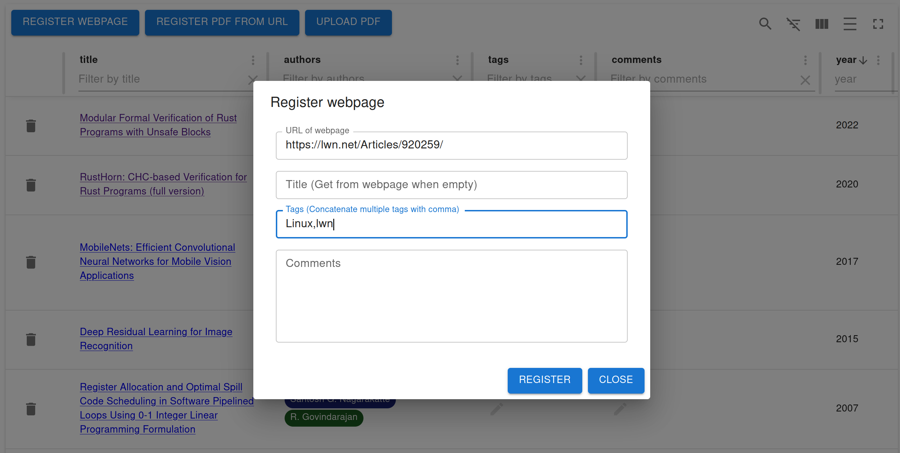
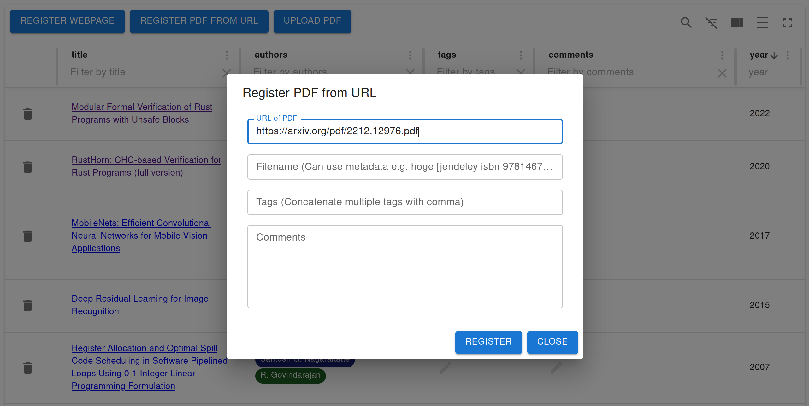
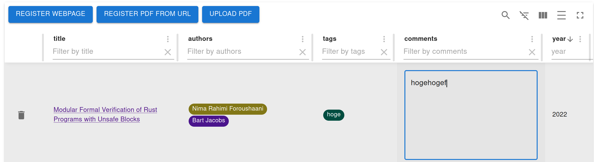

# jendeley <!-- omit in toc -->
`jendeley` is a JSON-based document organizing software.
- `jendeley` is JSON-based. You can see and edit your database quickly.
- `jendeley` works locally. Your important database is owned only by you. No cloud.
- `jendeley` is browser-based. You can run it anywhere node.js runs.

## Table of Contents <!-- omit in toc -->
- [Why jendeley?](#why-jendeley)
- [Quickstart](#quickstart)
- [Install](#install)
- [Generate JSON database file](#generate-json-database-file)
  - [Recommended filename style](#recommended-filename-style)
  - [When `jendeley` fails to scan your PDFs](#when-jendeley-fails-to-scan-your-pdfs)
- [Launch the service daemon and open the web user interface](#launch-the-service-daemon-and-open-the-web-user-interface)
  - [Launch `jendeley` automatically](#launch-jendeley-automatically)
    - [Linux](#linux)
    - [Windows](#windows)
- [Use the web user interface](#use-the-web-user-interface)
  - [Add a webpage](#add-a-webpage)
  - [Add a PDF file on the Web](#add-a-pdf-file-on-the-web)
  - [Upload a PDF file](#upload-a-pdf-file)
  - [Use tags and comments](#use-tags-and-comments)
- [Advanced topics](#advanced-topics)
  - [Check and edit your database (advanced)](#check-and-edit-your-database-advanced)
  - [Check source code (advanced)](#check-source-code-advanced)
- [Contact me](#contact-me)
- [Support me](#support-me)

## Why jendeley?
Programmers need various documents. In addition to it, they are in various formats. For example, they are papers on the newest machine learning, classic compiler books, specification documents of our CPU or accelerators, document of programming languages, or useful blog articles. Programmers must organize these documents classified. Furthermore, we must save them in the long term, such as ten years, because we cannot know when we need them.

To satisfy such challenging requirements, I developed `jendeley`. You can register PDFs or webpages into the same database. You can easily categorize documents using tags. Furthermore, most importantly, the database is just a plain text JSON file. You can edit it using your favorite editor and develop an alternative application even if I failed to continue `jendeley` development.

## Quickstart
```
npm install @a_kawashiro/jendeley -g
jendeley scan --papers_dir <YOUR PDFs DIR>
jendeley launch --db <YOUR PDFs DIR>/jendeley_db.json
```
Then you can see a screen like this!


## Install
```
npm install @a_kawashiro/jendeley -g
```
You can find the latest package at [npm page](https://www.npmjs.com/package/@a_kawashiro/jendeley).

## Generate JSON database file
```
jendeley scan --papers_dir <YOUR PDFs DIR>
```
This command outputs the database to `<YOUR PDFs DIR>/jendeley_db.json`. If you have no PDF file, please specify an empty directory as `<YOUR PDFs DIR>`.

When `jendeley` fails to scan some PDFs, it generates a shell script named `edit_and_run.sh`. Please read the following subsection and use it to rename files appropriately so that jendeley can recognize them.

### Recommended filename style
`jendeley` uses a filename to find the document ID (e.g., [DOI](https://www.doi.org/) or [ISBN](https://en.wikipedia.org/wiki/ISBN))). `jendeley` recognizes parts of a filename that are not enclosed by `[` and `]` as the title of the file. So I recommend you to name the file accordingly, for example,
- `RustHorn CHC-based Verification for Rust Programs.pdf`
  - When the document's title includes spaces, the filename should include spaces.
- `RustHorn CHC-based Verification for Rust Programs [matushita].pdf`
  - If you want to write additional information in a filename, please enclose it by `[` and `]`.

### When `jendeley` fails to scan your PDFs
`jendeley` heavily relies on [DOI](https://www.doi.org/) or [ISBN](https://en.wikipedia.org/wiki/ISBN) to find the title, authors and published the year of PDFs. So `jendeley` tries to find the DOI of a given PDF in multiple ways. But sometimes, it fails to find DOI. In such cases, you can manually specify DOI of the PDF using the filename.

- To specify DOI, change the filename to include `[jendeley doi <DOI with all delimiters replaced with underscore>]`.
  - For example, `cyclone [jendeley doi 10_1145_512529_512563].pdf`.
- To specify ISBN, change the filename to include `[jendeley isbn <ISBN>]`.
  - For example, `Types and Programming Languages [jendeley isbn 0262162091].pdf`.
- When the PDF doesn't have any DOI or ISBN, you can specify it by `[jendeley no id]`.
  - For example, `ARM reference manual [jendeley no id].pdf`.

## Launch the service daemon and open the web user interface
```
jendeley launch --db <YOUR PDFs DIR>/jendeley_db.json
```
This command starts `jendeley` daemon and open the web user interface in your browser. You can use `--port` option to change the default port.

### Launch `jendeley` automatically
#### Linux
When using Linux, you can launch `jendeley` automatically using `systemd`. Please make `~/.config/systemd/user/jendeley.service` with the following contents, run `systemctl --user enable jendeley && systemctl --user start jendeley` and access [http://localhost:5000](http://localhost:5000). You can check the log with `journalctl --user -f -u jendeley.service`.
```
# jendeley.service
[Unit]
Description=jendeley JSON-based document organization software

[Service]
ExecStart=jendeley launch --db <FILL PATH TO THE YOUR DATABASE JSON FILE> --no_browser

[Install]
WantedBy=default.target
```
#### Windows
When using Windows, you can launch `jendeley` automatically using startup. First, open the startup directory by `Windows+R` and type `shell:startup` and `Enter`.


And make `autorun-jendeley.bat` with the following contents using `notepad.exe`.
```
:: autorun-jendeley.bat
jendeley launch --db <FILL PATH TO THE YOUR DATABASE JSON FILE> --no_browser >> <FILL PATH TO THE LOG FILE>
```


## Use the web user interface
When `jendeley` launches, `jendeley` opens the web user interface automatically. If not, please access `http://localhost:5000/`. 


### Add a webpage
You can add a webpage to the database using `REGISTER WEBPAGE` button. When you register, you can write tags or comments. Tags are just commas (`,`) separated text. By the way, the date tags are automatically added to the database.



### Add a PDF file on the Web
You can add a PDF file on the Web using `REGISTER PDF FROM URL` button. When you add, `jendeley` try to find [Digital object identifier(DOI)](https://www.doi.org/) or [International Standard Book Number(ISBN)](https://en.wikipedia.org/wiki/ISBN) of the PDF file and register meta information such as authors or publication date to the database. However, sometimes, `jendeley` cannot find DOI or ISBN of the PDF or there is no corresponding DOI or ISBN to it. You can specify DOI or ISBN using its filename in such a case. Please check [Recommended filename style](#recommended-filename-style) section for more details.


### Upload a PDF file
You can upload a PDF file in your computer using `UPLOAD PDF` button.

### Use tags and comments
You can edit tags or comments after you register. You can edit tags or comments by double-clicking them.



Furthermore, you can filter the database using tags or comments.


## Advanced topics
### Check and edit your database (advanced)
Because `jendeley` is fully JSON-based, you can quickly check the database's contents.
```
> cat jendeley_db.json | jq '.' | head
{
  "jendeley_meta": {
    "idType": "meta",
    "version": "0.0.17"
  },
  "doi_10.1145/1122445.1122456": {
    "path": "/A Comprehensive Survey of Neural Architecture Search.pdf",
    "idType": "doi",
    "tags": [],
    "comments": "",
```

You can edit your database using your favorite editor. But after editing, you should check if your database is valid as a `jendeley` database by `jendeley validate --db <PATH TO THE DATABASE>`.

### Check source code (advanced)
You can check the source code [https://github.com/akawashiro/jendeley](https://github.com/akawashiro/jendeley) here. We welcome your pull request.

## Contact me
I'm on [https://twitter.com/a_kawashiro](https://twitter.com/a_kawashiro) and [https://mstdn.jp/@a_kawashiro](https://mstdn.jp/@a_kawashiro). And, of course, feel free to make an issue or a PR to [the repository](https://github.com/akawashiro/jendeley).

## Support me
Please star [akawashiro/jendeley](https://github.com/akawashiro/jendeley). It encourages me a lot.
