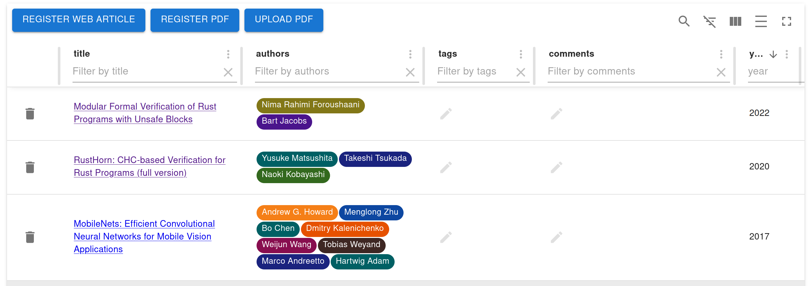
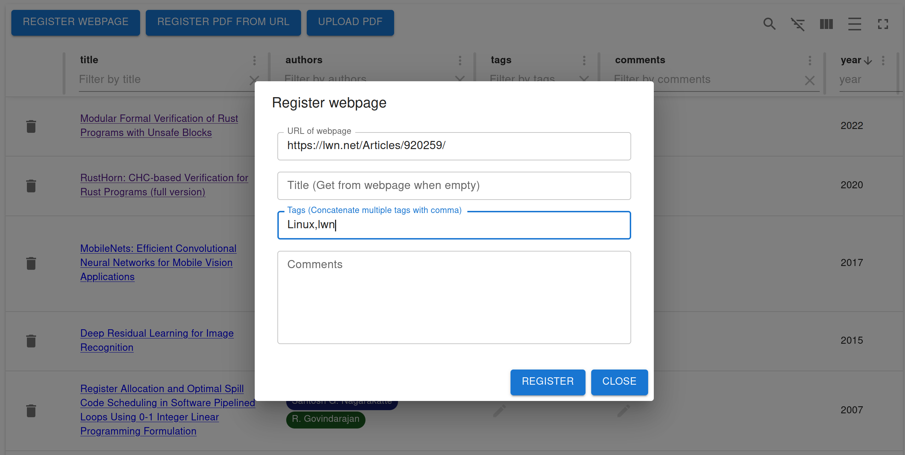
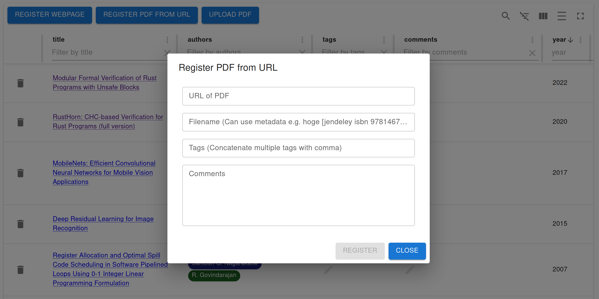
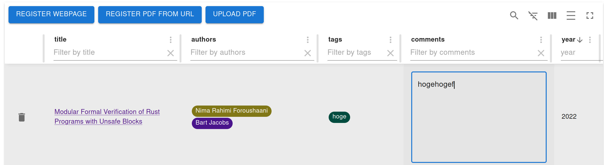
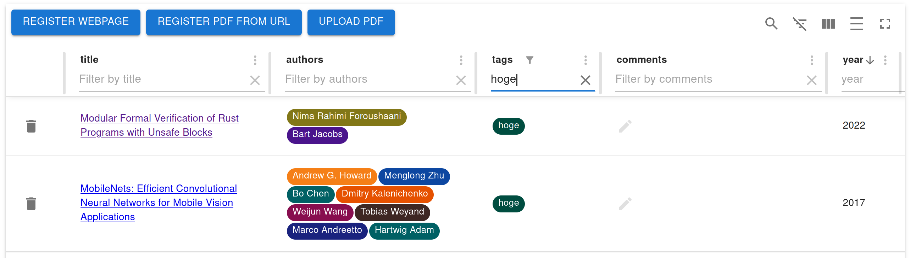

# jendeley - JSON based document organizing software

In order to organize documents which I read in my daily life as programmer, I made a software - `jendely`. `jendeley` is a JSON based document organizing software. `jendeley` can organize and search variouse documents such as papers, books, specification documents or webpages.

 <a href="https://github.com/akawashiro/jendeley"></a> 

## Motivation
Programmers need varioues documents. In addition to it, they are in various formats. For example, they are papers on the newest machine learning, classic compiler books, specification documents of our CPU or acceslarators, document of programming languages or useful blog articles. Programmers must orgranize these documents classified into categories. Furthermore, these  


プログラマには様々なドキュメントが必要です。しかも、それらは様々な形で提供されます。例えば、最新の機械学習モデルについての論文、古典的なコンパイラの本、使用するCPU・アクセラレータの仕様書、プログラミング言語のドキュメント、有用な個人ブログ等々です。また、これらのドキュメントは関連付けし整理して保管する必要があります。更に、これらのドキュメントは何年後に参照するかがわからないため、長期に渡って参照可能な形式で保存しなければなりません。

このような要求を満たすために`jendeley`は開発されました。`jendeley` はPDFやウェブページを同一のデータベースに登録することができます。タグを使えばドキュメントの整理も簡単です。更に、データベースの実体はプレーンなJSONファイルです。テキストエディタで編集が可能ですし、将来`jendeley` 自体が動かなくなる日が来たとしても、あなたが代替のソフトウェアを簡単に開発することができます。

## 動機
プログラマには様々なドキュメントが必要です。しかも、それらは様々な形で提供されます。例えば、最新の機械学習モデルについての論文、古典的なコンパイラの本、使用するCPU・アクセラレータの仕様書、プログラミング言語のドキュメント、有用な個人ブログ等々です。また、これらのドキュメントは関連付けし整理して保管する必要があります。更に、これらのドキュメントは何年後に参照するかがわからないため、長期に渡って参照可能な形式で保存しなければなりません。

このような要求を満たすために`jendeley`は開発されました。`jendeley` はPDFやウェブページを同一のデータベースに登録することができます。タグを使えばドキュメントの整理も簡単です。更に、データベースの実体はプレーンなJSONファイルです。テキストエディタで編集が可能ですし、将来`jendeley` 自体が動かなくなる日が来たとしても、あなたが代替のソフトウェアを簡単に開発することができます。

## 基本な使い方
### インストール
`npm i @a_kawashiro/jendeley` でインストールできます。
### データベースの初期化
`jendeley scan --papers_dir <YOUR PDFs DIR>` でデータベースを初期化します。スキャンしたいPDFがない場合は適当なディレクトリを作ってそこを指定すれば良いです。
### Web UIの起動
先程指定した `<YOUR PDFs DIR>` の中に `jendeley_db.json` というファイルができているはずなのでこのパスを指定して `jendeley launch --db <YOUR PDFs DIR>/jendeley_db.json` のように起動します。 


### ウェブページの追加
データベースへのウェブページの追加は`REGISTER WEBPAGE` ボタンから行えます。このとき、タグやコメントを書くことができます。タグはコンマ(`,`)区切りの文字列です。なお、追加した日のタグは自動で追加されます。


### ウェブ上のPDFファイルの追加
`REGISTER PDF FROM URL`ボタンでウェブ上のPDFファイルをURLから直接追加できます。データベースにPDFファイルを追加する際、`jendeley` はPDFファイルの[Digital object identifier(DOI)](https://www.doi.org/)または[International Standard Book Number(ISBN)](https://en.wikipedia.org/wiki/ISBN)を特定し、PDFファイルの著者、出版日時などの情報をデータベースに追加します。PDFファイルによってはDOIまたはISBNが特定できない、もしくは対応するDOIまたはISBNが存在しないことがあります。この場合は、ファイル名を指定することで `jendeley` に追加の情報を伝えることができます。詳しくは[ファイル名を使ったDOIまたはISBNの指定](#ファイル名を使ったDOIまたはISBNの指定)で説明します。


### ローカルのPDFファイルの追加
`UPLOAD PDF` ボタンでローカルのPDFファイルを追加することも可能です。
### タグ、コメントの使い方
タグやコメントは追加したあとで編集することもできます。編集したいエントリのタグ、コメント部分をダブルクリックすると編集できるようになります。


また、タグやコメントを使ってデータベースをフィルタすることも可能です。


## 発展的な使い方
### ファイル名を使ったDOIまたはISBNの指定
`jendeley` はPDFファイルをパースしてDOIまたはISBNを特定しようとしますが、失敗することもあります。このような場合、ファイル名を使ってDOIまたはISBNを指定することができます。

DOIを指定したい場合は、ファイル名に`[jendeley doi <DOIの区切り文字をすべてアンダースコアで置き換える>]`を含めてください。例えば `cyclone [jendeley doi 10_1145_512529_512563].pdf` です。ISBNを指定したい場合は、ファイル名に `[jendeley isbn <ISBN>]` を含めてください。

チップのリファレンスマニュアルなど、DOIもISBNも持たない文書の場合は `[jendeley no id]` をファイル名含めてください。`ARM reference manual [jendeley no id].pdf` 等です。

### JSONファイルの編集
`jendeley` のデータベースはプレーンなテキストファイルです。例えばタグは単なる文字列のリストとして、コメントは単なる文字列として保存されています。
```
> head -n 18 test_pdfs/jendeley_db.json
{
  "jendeley_meta": {
    "idType": "meta",
    "version": "0.0.25"
  },
  "arxiv_2212.12976": {
    "path": [
      "Modular Formal Verification of Rust Programs with Unsafe Blocks [jendeley download 1673165594267].pdf"
    ],
    "idType": "arxiv",
    "tags": [
      "hoge"
    ],
    "comments": "hogehogefuga",
    "dataFromArxiv": {
      "id": "http://arxiv.org/abs/2212.12976v1",
      "updated": "2022-12-26T00:19:19Z",
      "published": "2022-12-26T00:19:19Z",
```
このデータレースはテキストエディタ等でユーザが編集することを想定しています。編集した後は、`jendeley validate --db jendeley_db.json` で `jendeley` のデータベースとして妥当なものであることをチェックしてください。

### 同じデータベースの複数のコンピュータでの共有
`jendeley` のデータベースはクロスプラットホームで動作するように設計されています。具体的にはLinux, Windows, MacOSで同じデータベースを共有できます。このため、`<YOUR PDFs DIR>`をDropbox等で共有すれば同じデータベースを複数のコンピュータで使用することができます。

### gitを使ったデータベースの管理
`jendeley` はデータベースを可能な限りテキストとしての差分が小さくなるように編集します。このため、`git` を使ってデータベースを管理することができます。僕は `<YOUR PDFs DIR>` をDropboxに入れた上で `git` 管理しています。

## お願い
[Githubのjendeleyのリポジトリ](https://github.com/akawashiro/jendeley)にスターしてください。

## 謝辞
最初のユーザとしてインストールして感想をくださった [Shuhei Kadowaki](https://twitter.com/kdwkshh)さんと[たまろん](https://twitter.com/tamaroning)さん、不慣れなフロントエンド開発についてアドバイスをくださった[あさくら](https://twitter.com/asakura_dev)さんと[gky360](https://twitter.com/gky360)にこの場を借りてお礼を申し上げます。