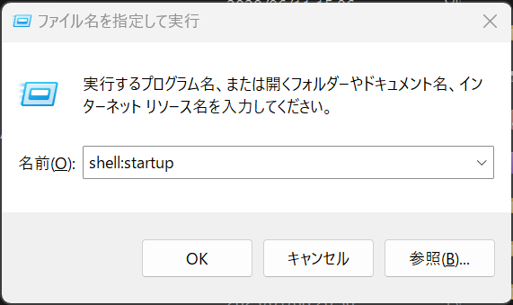
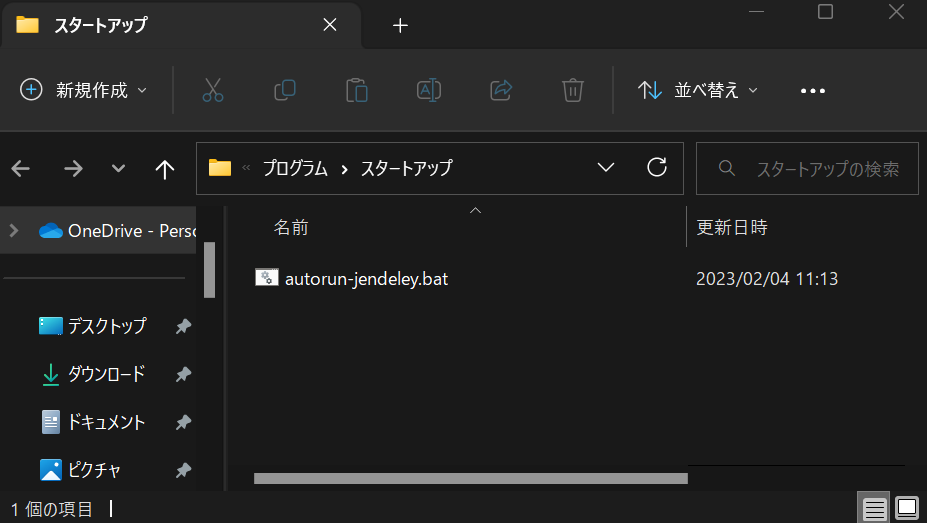

# jendeley <!-- omit in toc -->
`jendeley` is a JSON-based PDF paper organizing software.
- `jendeley` is JSON-based. You can see and edit your database easily.
- `jendeley` is working locally. Your important database is owned only by you. No cloud.
- `jendeley` is browser based. You can run it anywhere node.js runs.

## Table of Contents <!-- omit in toc -->
- [Quickstart](#quickstart)
- [Install](#install)
- [Generate JSON database file](#generate-json-database-file)
  - [Recommended filename style](#recommended-filename-style)
  - [When `jendeley` fails to scan your PDFs](#when-jendeley-fails-to-scan-your-pdfs)
- [Launch `jendeley` UI](#launch-jendeley-ui)
  - [Launch `jendeley` automatically](#launch-jendeley-automatically)
- [Use web interface](#use-web-interface)
- [Check and edit your database (advanced)](#check-and-edit-your-database-advanced)

## Quickstart
```
npm install @a_kawashiro/jendeley -g
jendeley scan --papers_dir <YOUR PDFs DIR>
jendeley launch --db <YOUR PDFs DIR>/jendeley_db.json
```
Then you can see a screen like this!


## Install
```
npm install @a_kawashiro/jendeley -g
```

## Generate JSON database file
This command outputs the database to `<YOUR PDFs DIR>/jendeley_db.json`. When `jendeley` fails to scan some PDFs, it generates a shellscript named `edit_and_run.sh`. Please read the next subsection and use it to rename files appropriately so that jendeley can recognize them.
```
jendeley scan --papers_dir <YOUR PDFs DIR>
```

### Recommended filename style
`jendeley` uses a filename to find the document ID (e.g. [DOI](https://www.doi.org/) or [ISBN](https://en.wikipedia.org/wiki/ISBN))). `jendeley` recognizes parts of a filename that are not enclosed by `[` and `]` as the title of the file. So I recommend you to name file accordingly, for example,
- `RustHorn CHC-based Verification for Rust Programs.pdf`
  - When the title of document includes spaces, the filename should also includes spaces.
- `RustHorn CHC-based Verification for Rust Programs [matushita].pdf`
  - If you want to write additional information in a filename, please enclose it by `[` and `]`.

### When `jendeley` fails to scan your PDFs
`jendeley` heavily relies on [DOI](https://www.doi.org/) or [ISBN](https://en.wikipedia.org/wiki/ISBN) to find the title, authors and published year of PDFs. So `jendeley` tries to find the DOI of a given PDF in multiple ways. But sometimes it fails to find DOI. In such cases, you can manually specify DOI of the PDF using the filename.

- To specify DOI, change the filename to include `[jendeley doi <DOI with all delimiters replaced with underscore>]`.
  - For example, `cyclone [jendeley doi 10_1145_512529_512563].pdf`.
- To specify ISBN, change the filename to include `[jendeley isbn <ISBN>]`.
  - For example, `Types and Programming Languages [jendeley isbn 0262162091].pdf`.
- When the PDF doesn't have any DOI or ISBN, you can specify it by `[jendeley no id]`.
  - For example `ARM reference manual [jendeley no id].pdf`.

## Launch `jendeley` UI
```
jendeley launch --db <YOUR PDFs DIR>/jendeley_db.json
```
You can use `--port` option to change the default port.

### Launch `jendeley` automatically
#### Linux
When you are using Linux, you can launch `jendeley` automatically using `systemd`. Please make `~/.config/systemd/user/jendeley.service` with the following contents, run `systemctl --user enable jendeley && systemctl --user start jendeley` and access [http://localhost:5000](http://localhost:5000). You can check the log with `journalctl --user -f -u jendeley.service`.
```
[Unit]
Description=jendeley JSON based document organization software

[Service]
ExecStart=jendeley launch --db <FILL PATH TO THE YOUR DATABASE JSON FILE> --no_browser

[Install]
WantedBy=default.target
```
#### Windows
When you are using Windonws, you can launch `jendeley` automatically using startup. First, open startup directory by `Windows+R` and type `shell:startup` and `Enter`.


And then make `autorun-jendeley.bat` with following contents using `notepad.exe`.
```
jendeley launch --db <FILL PATH TO THE YOUR DATABASE JSON FILE> --no_browser >> <FILL PATH TO THE LOG FILE>
```


## Use web interface


## Check and edit your database (advanced)
Because `jendeley` is fully JSON-based, you can check the contents of the database easily.
```
> cat jendeley_db.json | jq '.' | head
{
  "jendeley_meta": {
    "idType": "meta",
    "version": "0.0.17"
  },
  "doi_10.1145/1122445.1122456": {
    "path": "/A Comprehensive Survey of Neural Architecture Search.pdf",
    "idType": "doi",
    "tags": [],
    "comments": "",
```

You can edit you database using your favorite editor. But after editing, you should check if your database is valid as a `jendeley` database by `jendeley validate --db <PATH TO THE DATABASE>`.
