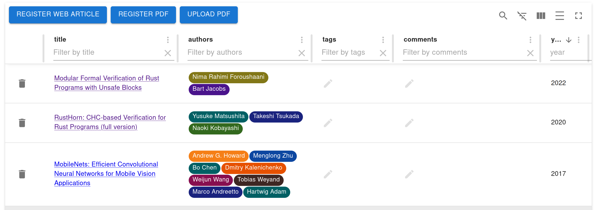

# jendeley
`jendeley` is a JSON-based PDF paper organizing software.
- `jendeley` is JSON-based. You can see and edit your database easily.
- `jendeley` is working locally. Your important database is owned only by you. Not cloud.
- `jendeley` is browser based. You can run it anywhere node.js runs.

## Quickstart
```
npm install @a_kawashiro/jendeley -g
jendeley scan --papers_dir <YOUR PDFs DIR>
jendeley launch --db <YOUR PDFs DIR>/jendeley_db.json
```
Then you can see a screen like this!


Please check [user document](https://akawashiro.github.io/jendeley/) for more details.
